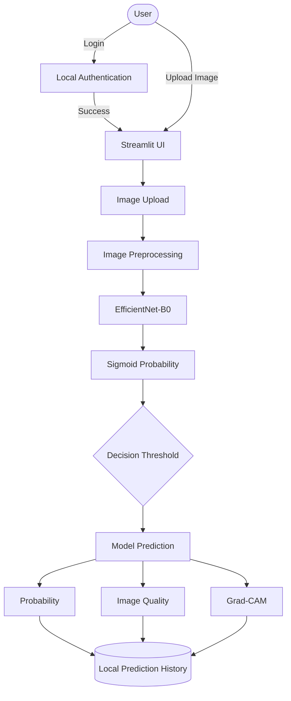

# Offline Skin Lesion Analyzer

An offline AI research and educational prototype for analyzing skin-lesion images using a fine-tuned EfficientNet-B0 binary classifier, with model probability outputs, threshold context, image-quality analysis, Grad-CAM explainability, local prediction history, and local authentication.

> [!WARNING]
> **Safety Disclaimer:** This project is an AI research and educational prototype. Model probabilities represent statistical outputs from the trained model and are not measures of medical certainty. The system is not a medical diagnostic device and should not be used to make clinical decisions.

---

## 1. Project Overview

The Offline Skin Lesion Analyzer demonstrates a complete, offline machine learning pipeline focusing on computer vision and interpretability. It was built to explore binary classification of skin lesions, prioritizing rigorous dataset handling (preventing leakage through lesion-grouped splits) and transparent model outputs. The system provides a fully local Streamlit web application that runs inferences securely without cloud dependencies. As a research and educational prototype, it explores how deep learning models respond to complex biological image data while actively rejecting clinical diagnostic claims.

## 2. Key Features

- **Offline image inference:** All processing is conducted locally without cloud dependencies.
- **Fine-tuned EfficientNet-B0:** Uses a customized convolutional neural network for inference.
- **Binary classification:** Distinguishes between Non-malignant and Malignant-Suspicious image patterns.
- **Estimated model probabilities:** Provides continuous probabilistic scores derived via Sigmoid activation.
- **Decision-threshold context:** Explains outputs relative to a strict 0.50 decision boundary.
- **Threshold-distance interpretation:** Contextualizes the classification sensitivity based on threshold proximity.
- **Image-quality assessment:** Heuristic evaluation of image resolution, brightness, and sharpness.
- **Grad-CAM explainability:** Visualizes the spatial regions contributing most to the model's prediction.
- **Local prediction history:** Logs application usage and model outputs to a local CSV file.
- **Local authentication:** Secures application access via PBKDF2-HMAC-SHA256 password hashing.
- **Light/Dark/System UI support:** Fully responsive Streamlit interface natively adapting to OS themes.

## 3. System Architecture



## 4. Machine Learning Pipeline

The project follows a rigorous end-to-end ML pipeline:
Dataset → Metadata processing → Binary label mapping → Grouped train/validation/test split → Image preprocessing/augmentation → Model training → Fine-tuning → Validation model selection → Held-out test evaluation → Error analysis.

**Binary Mapping:**
To simplify the complex seven-class dataset for this educational binary prototype, the classes are mapped as follows:
- **Non-malignant:** NV, BKL, DF, VASC
- **Malignant-Suspicious:** MEL, BCC, AKIEC

*This binary grouping is a project-specific mapping for statistical evaluation and is not equivalent to a clinical diagnosis.*

## 5. Dataset

The project relies on the publicly available HAM10000 / ISIC dataset, which originally contains 10,015 dermatoscopic images categorized into seven diagnostic classes. The raw dataset is grouped into the binary schema detailed above. Due to GitHub repository size limits and licensing best practices, the raw dataset is **not** committed to Git. Users wishing to replicate the training must download the HAM10000 dataset independently.

## 6. Model

- **Architecture:** EfficientNet-B0 (fine-tuned)
- **Classification Setup:** Binary classification with a customized linear head.
- **Input Image Size:** 224x224 RGB.
- **Preprocessing/Normalization:** Standard ImageNet normalization (`mean=[0.485, 0.456, 0.406]`, `std=[0.229, 0.224, 0.225]`).
- **Output Interpretation:** A single binary logit passed through a Sigmoid activation to produce an estimated model probability between 0 and 1.
- **Decision Threshold:** The application is currently configured to use a `0.50` threshold. This is the application classification threshold, not a clinically optimized boundary.

## 7. Model Evaluation

The model was rigorously evaluated on an exclusively held-out test set containing 1494 images. These results represent the project's held-out statistical performance and **should not** be interpreted as clinical validation or universal real-world performance.

| Metric | Result |
|---|---:|
| Accuracy | 68.47% |
| Precision | 39.53% |
| Recall / Sensitivity | 90.88% |
| Specificity | 62.41% |
| F1-score | 55.10% |
| ROC-AUC | 85.37% |

**Confusion Matrix (Threshold = 0.50):**
- True Negatives (TN) = 734
- False Positives (FP) = 442
- False Negatives (FN) = 29
- True Positives (TP) = 289

*Note: ROC-AUC evaluates the model's discriminative capability across all possible thresholds, whereas the other metrics are dependent on the specific 0.50 threshold.*

## 8. Baseline vs Fine-Tuned Model

A comparison was conducted between the initial baseline training and the fine-tuned checkpoint on the held-out test set:

| Metric | Baseline | Fine-tuned | Change |
|---|---|---|---|
| Accuracy | 65.80% | 68.47% | Increased |
| Precision | 37.61% | 39.53% | Increased |
| Recall | 92.14% | 90.88% | Decreased slightly |
| Specificity | 58.67% | 62.41% | Increased |
| F1 | 53.42% | 55.10% | Increased |
| ROC-AUC | 82.50% | 85.37% | Increased |

The fine-tuning process improved the model's overall discriminative ability (higher ROC-AUC), reduced false positives (improved Specificity and Precision), and increased overall Accuracy and F1-score, with a negligible trade-off in Recall.

## 9. Threshold Analysis

A detailed threshold analysis was performed across boundaries from 0.10 to 0.90. As expected, threshold-dependent metrics (Accuracy, Precision, Recall, Specificity) change significantly as the threshold moves. The 0.50 threshold is simply the current default application configuration for this research prototype. It was not chosen via test-set threshold optimization, nor is it a clinically optimized threshold. ROC-AUC (85.37%) remains a reliable holistic indicator since it does not depend on selecting a single threshold.

## 10. Error Analysis

An extensive error analysis was conducted on the 471 total errors made on the held-out test set:
- **False Positives:** 442 instances. The non-malignant classes NV and BKL account for the large majority of these false positives, indicating that the model struggles to distinguish them from malignant lesions under the current binary grouping.
- **False Negatives:** 29 instances. MEL accounts for the majority of these false negatives.
This analysis strictly documents model behavior on the held-out test set. No medical conclusions can or should be drawn from these individual image errors.

## 11. Explainability

The application implements Grad-CAM (Gradient-weighted Class Activation Mapping). Grad-CAM provides a visualization of image regions that contributed more strongly to the model output. It is intended strictly to help inspect and understand model behavior from a computer vision perspective. It is **not** a medical diagnostic map and should not be interpreted as clinical evidence.

## 12. Image Quality Analysis

The application performs basic programmatic image-quality checks during upload, calculating heuristics for:
- Resolution
- Brightness
- Sharpness

These provide basic input-quality information to the user and are entirely separate from the deep learning model prediction. Favorable image quality does not guarantee prediction reliability.

## 13. Authentication

The system secures the UI using a local authentication implementation:
- Local username and password authentication.
- Users are stored locally in `auth/users.json`.
- Passwords are securely hashed using `PBKDF2-HMAC-SHA256` with randomly generated salts.
- Sessions are managed securely via local Streamlit session state.
- There is no cloud authentication, OAuth, or external authentication service involved.
- For security, `auth/users.json` is strictly excluded from Git version control.

## 14. Prediction History

To facilitate session review, predictions are stored locally:
- The history file is located at `history/prediction_history.csv`.
- Stored fields include the timestamp, original image name, prediction, probabilities, model output strength, and image quality heuristics.
- This is a local application history and is **not** committed to Git.

## 15. Technology Stack

| Category | Technology |
|---|---|
| **Language** | Python |
| **Machine Learning** | PyTorch, Torchvision |
| **Image Processing** | Pillow, OpenCV |
| **Data Handling** | NumPy, Pandas |
| **Visualization** | Matplotlib |
| **Application UI** | Streamlit |
| **Explainability** | pytorch-grad-cam |
| **Authentication** | Python standard library `hashlib`, `secrets` |
| **Version Control** | Git, GitHub |

## 16. Project Structure

```text
OFFLINE-SKIN-CANCER-DETECTION/
├── app/
│   └── app.py
├── src/
│   ├── analyze_dataset.py
│   ├── create_binary_dataset.py
│   ├── create_splits.py
│   ├── dataset.py
│   ├── evaluate.py
│   ├── finetune.py
│   ├── model.py
│   └── train.py
├── data/
│   ├── raw/                  # Excluded from Git
│   └── processed/            # Excluded from Git
├── models/                   # Excluded from Git
├── reports/
├── history/                  # Excluded from Git
├── auth/                     # Excluded from Git
├── requirements.txt
├── README.md
└── .gitignore
```
*Note: Directories marked as excluded from Git are created locally at runtime or data-prep time.*

## 17. Installation

1. **Clone the repository:**
   ```bash
   git clone https://github.com/rakshitha249/OFFLINE-SKIN-CANCER-DETECTION.git
   cd OFFLINE-SKIN-CANCER-DETECTION
   ```

2. **Create a virtual environment:**
   ```bash
   python -m venv .venv
   ```

3. **Activate the environment:**
   - *Windows (Git Bash):* `source .venv/Scripts/activate`
   - *Windows (PowerShell):* `.\.venv\Scripts\Activate.ps1`
   - *macOS/Linux:* `source .venv/bin/activate`

4. **Install dependencies:**
   ```bash
   pip install -r requirements.txt
   ```

**Important:** A fresh clone does not immediately run inference. You must supply a trained model checkpoint (e.g., `best_finetuned_model.pth`) inside the `models/` directory, which is excluded from Git due to file size constraints.

## 18. Running the Application

Once the environment is configured and the model checkpoint is present in `models/`:

Run the application:
```bash
python -m streamlit run app/app.py
```
*(Alternative Windows direct command: `./.venv/Scripts/python.exe -m streamlit run app/app.py`)*

Access the application in your browser at `http://localhost:8501`.
On the first run, if `auth/users.json` does not exist or is empty, the application will prompt you to complete a first-run local account setup to create your secure offline credentials.

## 19. Reproducibility

This project emphasizes reproducibility within the bounds of repository constraints:
- All Python dependencies are strictly pinned in `requirements.txt`.
- Data splitting uses precise lesion-grouping to reduce data leakage.
- Extensive evaluation artifacts are documented and stored in the `reports/` directory.
- **Limitation:** The raw dataset and the trained model checkpoints are intentionally excluded from Git. A fresh clone requires the user to independently download the HAM10000 dataset into `data/raw/` and execute the `src/` training scripts, or manually place a pre-trained `.pth` checkpoint in `models/`.

## 20. Limitations

This prototype has significant technical limitations:
- The model performs binary classification rather than utilizing the original seven-class structure.
- Evaluation is dataset-specific; there is no claim of real-world or general clinical performance.
- The model exhibits high rates of false positives (especially on NV and BKL lesions).
- Image acquisition variability (lighting, zoom, skin tone) strongly impacts predictions.
- **There is no clinical validation and no diagnosis capability.**

## 21. Safety and Responsible Use

This project is an AI research and educational prototype. Model probabilities represent statistical outputs from the trained model and are not measures of medical certainty. The system is not a medical diagnostic device and should not be used to make clinical decisions.

## 22. Results and Project Status

Current status: Functional research and educational prototype.
The current implementation successfully integrates a fine-tuned model, held-out evaluation reports, error analysis, a robust local Streamlit application with Grad-CAM explainability, image-quality analysis, local authentication, and prediction history. It executes entirely offline.

## 23. Future Improvements

Technically reasonable future work could include:
- Expanding to multiclass classification.
- Utilizing advanced class balancing techniques during training.
- Conducting external validation on completely distinct datasets.
- Performing formal probability calibration analysis.
- Developing a stronger, deep-learning-based image-quality assessment module.
- Comparing multiple architecture backbones (e.g., ResNet, ConvNeXt).
- Improving the packaging and distribution of the application.

## 24. License / Dataset License

The source code is provided for research and educational review.
The HAM10000 dataset is utilized under its original academic licensing terms (CC BY-NC 4.0). Please refer to the official ISIC Archive for dataset usage rights and restrictions.
