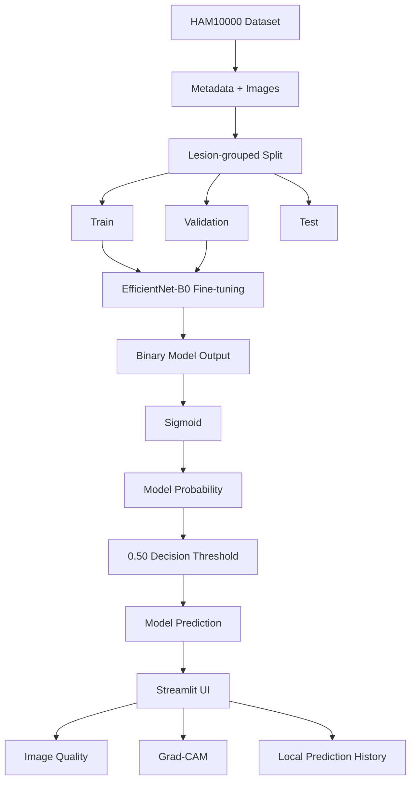

# System Architecture

## 1. Overview
This project is an offline AI research and educational prototype designed for binary skin-lesion classification. It utilizes a fine-tuned EfficientNet-B0 model to evaluate images locally, providing statistical probabilities rather than medical diagnoses.

## 2. High-Level Pipeline
The architecture consists of a training pipeline that processes raw data into a trained model checkpoint, and an inference pipeline that serves predictions through a local web interface.

## 3. Dataset and Label Pipeline
The project utilizes the HAM10000 dataset, containing seven original diagnostic classes, which are mapped to a binary research schema:

**Non-malignant (Class 0):**
- NV
- BKL
- DF
- VASC

**Malignant-Suspicious (Class 1):**
- MEL
- BCC
- AKIEC

This binary mapping enables the model to output a single statistical probability for research and educational analysis.

## 4. Data Splitting
To prevent data leakage, the dataset is split using `GroupShuffleSplit` grouping by `lesion_id`. This ensures that all images belonging to the same physical lesion remain exclusively in either the train, validation, or test set.

- **Training:** ~70%
- **Validation:** ~15%
- **Test:** ~15% (Exactly 1494 images held out strictly for final evaluation)

## 5. Training Pipeline
The training pipeline processes the data through two phases (initial training and fine-tuning). 

During fine-tuning:
- Uses training data augmentations including RandomHorizontalFlip, RandomVerticalFlip, RandomRotation, and ColorJitter.
- Calculates dynamic positive class weighting to combat dataset imbalance.
- Utilizes the AdamW optimizer (learning rate = 0.00001) and BCEWithLogitsLoss.
- The best model checkpoint is selected dynamically based on the highest Validation ROC-AUC achieved across epochs.

## 6. Model Architecture
- **Backbone:** EfficientNet-B0
- **Classification Head:** Adapted to output a single logit (binary output).
- **Probability Mapping:** The raw output is passed through a Sigmoid activation to produce an estimated model probability between 0 and 1.
- **Threshold:** A strict 0.50 decision threshold determines the final discrete prediction (Malignant-Suspicious vs. Non-malignant).

## 7. Inference Pipeline
Inference is conducted locally within a Streamlit UI:
1. User uploads a local image via the browser.
2. The image is opened locally using PIL.
3. The image undergoes standard inference preprocessing.
4. The tensor is passed through the trained EfficientNet-B0.
5. The model output is converted to a probability via Sigmoid.
6. The value is compared against the 0.50 decision threshold.
7. The Streamlit application renders the model prediction and estimated model probability.
8. Parallel processing evaluates basic image quality and computes a Grad-CAM explainability heatmap.
9. Results are appended to a local prediction history CSV.

## 8. Image Preprocessing
**Training Augmentations:**
- Resize (224x224), RandomHorizontalFlip, RandomVerticalFlip, RandomRotation(20), ColorJitter, ToTensor, ImageNet Normalization.

**Validation/Test/Inference Preprocessing:**
- Resize (224x224), ToTensor, ImageNet Normalization (mean=[0.485, 0.456, 0.406], std=[0.229, 0.224, 0.225]).

## 9. Grad-CAM Explainability
Grad-CAM describes regions that contributed more strongly to the model output. It is an explainability visualization and is not a medical diagnostic map.

- **Target Layer:** EfficientNet-B0 `features[-1][0]`.
- **Target Logic:** Uses gradients derived from the single binary logit back to the target feature map to synthesize a heatmap overlay.

## 10. Image Quality Assessment
A programmatic evaluation operates alongside inference to provide immediate heuristic feedback on the uploaded image characteristics. This evaluates:
- **Resolution:** Checks absolute pixel dimensions.
- **Brightness:** Evaluates the mean grayscale pixel intensity (`np.mean`).
- **Sharpness:** Calculates pixel differences across X/Y axes (`np.var` of `np.diff`).

## 11. Prediction History
Model outputs generated during the application session are stored locally.
- **Format:** CSV
- **Path:** `history/prediction_history.csv`
- **Schema:** `timestamp, image_name, prediction, malignant_probability, non_malignant_probability, confidence, image_quality`

## 12. Offline Execution
The entire inference architecture operates strictly offline. It relies exclusively on a local Python environment, a locally loaded `.pth` model checkpoint, local image inputs, and local processing paths. There are no cloud APIs or external inference dependencies.

## 13. Limitations
This architecture represents a localized AI educational prototype. Evaluated outputs are purely statistical in nature and do not reflect verified medical severities or real-world clinical safety. Any structural findings exist strictly within the boundaries of the isolated HAM10000 dataset used during training.
