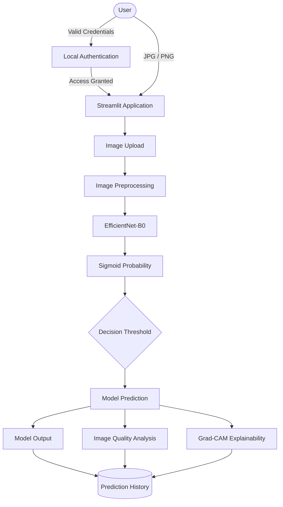

# Phase 13.3 — Architecture & Workflow

## 1. System Overview

The Offline Skin Lesion Analyzer is an offline AI research and educational prototype. It performs skin-lesion image analysis utilizing a fine-tuned EfficientNet-B0 binary classifier. The system is entirely implemented through a localized Streamlit application designed to deliver real-time, offline inference. This project focuses on end-to-end machine learning execution, dataset transparency, and model interpretability. It explicitly is not a medical diagnostic system and makes no claims to clinical utility or accuracy.

## 2. High-Level Architecture

The following diagram illustrates the application's localized system architecture:



All computational workloads occur strictly on local hardware, isolating user data from external network dependencies.

## 3. Machine Learning Pipeline

The project implements a comprehensive machine learning pipeline:

1. **Dataset**: Ingestion of the HAM10000 / ISIC image dataset.
2. **Metadata Processing**: Extraction of lesion IDs and original string diagnostics.
3. **Binary Label Mapping**: Collapsing seven diagnoses into a binary schema.
4. **Data Splitting**: Lesion-grouped Train/Validation/Test split creation via `GroupShuffleSplit`.
5. **Image Preprocessing**: Application of ImageNet normalization and training augmentations.
6. **Training**: Initial baseline model parameter optimization.
7. **Fine-tuning**: Targeted fine-tuning of the EfficientNet-B0 network.
8. **Validation**: Model checkpoint selection based on validation metrics.
9. **Test Evaluation**: Unseen evaluation on a strictly held-out dataset partition.
10. **Error Analysis**: Probabilistic and visual analysis of model failures.

## 4. Dataset and Label Mapping

The project utilizes the HAM10000 dataset, which natively features seven clinical diagnostic classes. For the purpose of this binary modeling prototype, the classes are mapped as follows:

**Non-malignant:**
- NV
- BKL
- DF
- VASC

**Malignant-Suspicious:**
- MEL
- BCC
- AKIEC

This categorization establishes the project's statistical modeling label scheme. It must not be interpreted as a clinical diagnostic mapping.

## 5. Data Splitting

Rigorous data isolation is enforced during the split generation process:
- The dataset is partitioned into approximately a 70% Train, 15% Validation, and 15% Test split.
- To prevent data leakage, the partition strictly enforces lesion-level grouping utilizing `GroupShuffleSplit`.
- Grouping by `lesion_id` guarantees that multiple photographic angles or magnifications of the exact same physical lesion remain exclusively within a single dataset partition. 

While this aggressively limits intra-dataset leakage, it does not magically eliminate underlying dataset biases related to lighting, skin-tone, or acquisition mechanisms.

## 6. Image Preprocessing

Input images traverse standardized preprocessing logic to match the network's expected feature dimensions:
- **Resizing**: Images are uniformly scaled to 224x224 pixels.
- **Tensor Conversion**: Standard PIL-to-Tensor conversion.
- **Normalization**: Standard ImageNet channel normalizations (`mean=[0.485, 0.456, 0.406]`, `std=[0.229, 0.224, 0.225]`).

*Training specific processing:*
During initial training, the pipeline applies data augmentations (e.g., random flips, rotations, and color jitter) to artificially expand variance and mitigate class imbalances.

## 7. Model Architecture

- **Backbone**: EfficientNet-B0.
- **Configuration**: Pre-trained weights fine-tuned on the HAM10000 subset.
- **Output Layer**: A fully connected linear layer modified to output a single binary logit.
- **Probability Output**: A Sigmoid activation function is applied to the logit to restrict output to a range between 0 and 1.
- **Target Checkpoint**: The system dynamically looks for `models/best_finetuned_model.pth`.
- **Dimensions**: The model exclusively accepts 224x224 RGB inputs.

## 8. Training and Fine-Tuning

The model optimization strategy occurred in phases:
- **Initial Training**: Core parameters were trained while managing data sampling strategies to address binary imbalance.
- **Fine-Tuning**: Select layers of the EfficientNet backbone were unfrozen for domain-specific fine-tuning.
- **Checkpoint Selection**: Throughout the designated epochs, validation metrics (primarily tracking loss and balanced accuracy) dictated which epoch's `.pth` checkpoint was ultimately retained for testing and application deployment.

## 9. Inference Workflow

Upon user upload within the Streamlit UI, the following sequence occurs locally:
1. Upload of JPG/PNG image file.
2. Read image buffer via PIL.
3. Preprocess and normalize image (224x224 RGB).
4. EfficientNet-B0 executes inference.
5. Sigmoid probability is derived from the model logit.
6. A 0.50 decision threshold evaluates the prediction class.
7. Model prediction is finalized.
8. Probability distribution is visualized in UI.
9. Threshold-distance interpretation is dynamically calculated.
10. Image quality heuristics are analyzed.
11. Grad-CAM visual overlay is generated.
12. A local history entry is logged in a CSV file.

## 10. Model Output Interpretation

The application yields multiple output data points:
- **Estimated Model Probability**: The raw decimal output (0-1) from the Sigmoid layer.
- **Malignant Probability / Non-malignant Probability**: Inverse mathematical complements (e.g., 60% vs 40%).
- **0.50 Threshold**: The static application boundary.
- **Threshold Distance**: A mathematical absolute difference indicating the output's proximity to the boundary (e.g., 0.51 is "Near-threshold", 0.95 is "Farther from decision threshold").
- **Model Output Strength**: A neutral description reflecting the threshold distance calculation.

These are strictly statistical model outputs. They do not constitute medical certainty or clinical confidence.

## 11. Image Quality Analysis

The application enforces heuristic basic-image checks:
- **Resolution**: Dimensions extracted directly from PIL.
- **Brightness**: Estimated via grayscale mathematical averages.
- **Sharpness**: Estimated utilizing Laplacian variance over the pixel matrix.

These metrics flag extreme outliers (e.g., very dark, heavily blurred) to inform the user of poor photographic input. They do not validate the image's suitability for clinical or medical assessment.

## 12. Grad-CAM Explainability

Gradient-weighted Class Activation Mapping (Grad-CAM) is integrated into the inference flow:
- Grad-CAM targets the final convolutional layers of the EfficientNet architecture.
- It computes a heatmap mapping back to the original image dimensions.
- The visualization highlights image regions contributing more strongly to the model output.

Grad-CAM is an explainability visualization of model behavior and is unequivocally not a medical diagnostic map.

## 13. Prediction History

- **Log File**: `history/prediction_history.csv`
- **Data Logged**: A timestamp, original image filename, final text prediction, estimated probabilities, output strength categorization, and image quality heuristic metrics.
- **Privacy**: The history is appended locally on the execution environment. It is explicitly excluded from version control systems.

## 14. Authentication Architecture

The application enforces access via an independent local authentication gateway:
- **Storage**: Valid user profiles are stored locally in `auth/users.json`.
- **Encryption**: Plaintext passwords are never stored. The system employs PBKDF2-HMAC-SHA256 with distinct, randomly generated cryptographic salts per user.
- **State**: Authentication maintains persistence strictly via Streamlit's local session state dictionary.
- **Access**: Secure logout logic clears the state dictionary. First-time execution generates an administrative setup flow.
- **Network Isolation**: The system interacts with zero cloud directories, external APIs, or OAuth providers.

## 15. Offline Architecture

The architecture mandates total operational network independence:
- Inference utilizes local `.pth` checkpoints.
- Image bytes are processed entirely in-memory via Streamlit.
- Authentication validates locally via standard library JSON and Hashlib modules.
- Prediction history modifies a local CSV.
- The web server utilizes a local TCP loopback (`localhost:8501`).

## 16. Evaluation Workflow

Following fine-tuning, the project executes an authoritative evaluation:
Held-out test dataset → Model inference over 1494 images → Probability extraction → Generation of binary predictions → Construction of Confusion matrix → Calculation of specific classification metrics (Accuracy, F1, Recall, Specificity) → Calculation of ROC curve and ROC-AUC → Threshold variance analysis → Error case identification → Deep-dive Error analysis → Export of representative failure images.

## 17. Error Analysis Workflow

The error analysis isolates statistical failure parameters:
- Extraction of False Positives (FP) and False Negatives (FN).
- Mapping back to original HAM10000 diagnostic identifiers (e.g., establishing that NV classes drive FPs).
- Aggregation of probability statistics to find confident vs unconfident failures.
- Grouping by lesion IDs.
- Algorithmic selection of representative outlier images.
- Plotting visual error grids.

This statistical error review examines model feature biases. It draws no medical conclusions from visual inspection.

## 18. Repository Architecture

**Tracked Project Files:**
```text
OFFLINE-SKIN-CANCER-DETECTION/
├── app/               # Application logic, CSS, UI definitions
├── src/               # Data splits, training, finetuning, and evaluation scripts
├── reports/           # Authoritative metrics, generated visualizations, and markdown audits
├── .gitignore         # Git exclusion instructions
├── requirements.txt   # Environment dependency definitions
└── README.md          # Project frontpage
```

**Local/Runtime Excluded Files (Not in Git):**
```text
├── data/
│   ├── raw/           # Raw HAM10000 images and CSV metadata
│   └── processed/     # Processed splits ensuring consistent leak-free boundaries
├── models/            # Heavy .pth weights
├── history/           # Local prediction log CSV
├── auth/              # Local hashed credentials
└── .venv/             # Local Python environment
```

## 19. End-to-End Workflow

1. User starts the local Streamlit application (`streamlit run app/app.py`).
2. User authenticates via the local PBKDF2-backed login portal.
3. User uploads a skin-lesion image via the file uploader.
4. Application evaluates basic image-quality characteristics (brightness/sharpness/resolution).
5. Image is preprocessed and normalized into a 224x224 tensor.
6. EfficientNet-B0 executes a local forward pass.
7. Sigmoid activation generates an estimated probability probability score.
8. The application applies the static 0.50 decision threshold.
9. Model prediction and probabilities are displayed in the main UI.
10. Threshold-distance context is calculated and shown.
11. Grad-CAM overlay is generated and presented in the explainability expander.
12. Prediction history is updated locally via CSV append.

## 20. Design Principles

The project was guided by specific technical philosophies:
- **Total Offline Inference**: Elimination of cloud APIs for secure, local execution.
- **Held-Out Evaluation**: Strict separation of final evaluation images to establish authentic ROC-AUC baselines.
- **Lesion-Level Grouping**: Preventing related photographic angles from compromising validation splits.
- **Transparent Uncertainty**: The use of deliberate, statistically cautious language ("Output strength", "Estimated probability").
- **Responsible AI Framing**: Aggressively contextualizing model limitations to prevent misuse as a diagnostic tool.
- **Hygiene**: Strict exclusion of private runtime logs and heavy binary artifacts from version control.

## 21. Known Limitations

As verified in the evaluation reports, the project holds several limitations:
- A binary simplification replaces the dataset's native seven-category clinical nuance.
- The model exhibits a disproportionate false-positive rate heavily influenced by `NV` (nevus) variants.
- The evaluation metrics remain explicitly dataset-bound and demonstrate no real-world generalization or clinical efficacy.
- Inference performance remains volatile under varying lighting, shadows, and magnification acquisition parameters.

## 22. Architecture Summary

The Offline Skin Lesion Analyzer establishes a cohesive, end-to-end framework. It begins with rigorous metadata extraction and lesion-grouped dataset partitioning, routing data through training and fine-tuning pipelines. The resulting EfficientNet-B0 checkpoint is statistically audited on a held-out test set prior to integration. Once deployed within the localized Streamlit web application, the model provides offline predictions, augmented by Grad-CAM explainability and automated image-quality checks, all while logging usage to local offline histories.
